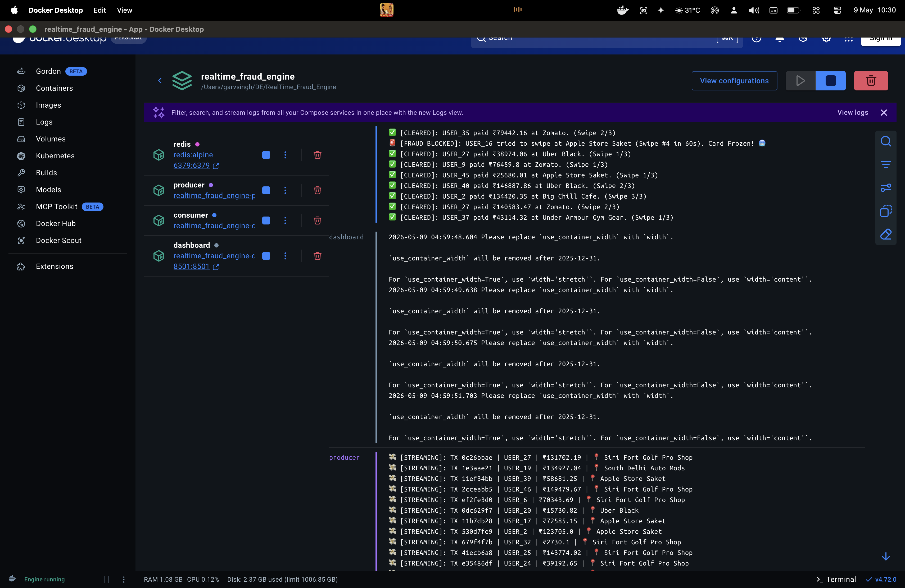

# 📡 Real-Time Fraud Detection Engine (Stream Processing)

## 📌 Executive Summary
A high-throughput, real-time data streaming infrastructure engineered to detect anomalies in milliseconds. Designed to handle massive scale (Tier-1 FinTech/GenAI workloads) while aggressively optimizing cloud compute costs (FinOps).

## 🏗️ The Architecture
*(Yahan apna architecture.png upload karke insert kar dena)*

## 🚀 Commercial Value (The ROI)
* 🌍 **Massive Scale Ingestion:** Utilizes **Redis In-Memory Streams** (`XADD`/`XREAD`) to process continuous, high-velocity telemetry and transaction data with zero-latency.
* 💰 **FinOps & Resource Efficiency:** Bypasses heavy hard-drive I/O bottlenecks. The entire infrastructure is containerized via **Docker**, ensuring isolated, lean, and predictable compute usage regardless of the deployment environment.
* 🛡️ **Fault Tolerance:** Built-in decoupled architecture. If the consumer fails, the Redis stream retains the data, ensuring zero data loss and automated recovery.
* 📊 **Observability:** Integrated with a **Streamlit** live radar for real-time executive dashboarding and anomaly tracking.

## ⚙️ Tech Stack
* **Streaming Engine:** Redis (Pub/Sub & Streams)
* **Processing & Logic:** Python, Pandas
* **Environment & DevOps:** Docker, Docker Compose
* **Observability UI:** Streamlit

## ⚡ Quick Start (Run it Locally in 60 Seconds)
```bash
# 1. Clone the repository
git clone [https://github.com/](https://github.com/)[Your-Username]/RealTime_Fraud_Engine.git
cd RealTime_Fraud_Engine

# 2. Fire up the isolated Docker environment
docker compose up --build

# 3. Access the Live Control Room
Go to http://localhost:8501 in your browser.

## 📸 System Previews



## 🧠 Architecture Flow
1. **Data Generation:** Synthetic transaction streams generated via `Faker`.
2. **Ingestion:** Producer asynchronously pushes events into **Redis Streams**.
3. **Processing:** Consumer continuously polls the stream, evaluating swipe-velocity rules.
4. **Validation:** Users exceeding threshold limits within a 60s TTL are instantly frozen.
5. **Observability:** Metrics and frozen accounts are broadcasted to a live **Streamlit** dashboard.

## 📂 Repository Structure
```text
RealTime_Fraud_Engine/
├── src/
│   ├── producer.py       # Simulates transaction payloads
│   ├── consumer.py       # Fraud detection logic
│   └── dashboard.py      # Streamlit UI
├── Dockerfile            # Container definition
├── docker-compose.yml    # Microservices orchestrator
├── requirements.txt      # Dependencies
└── README.md